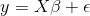
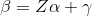
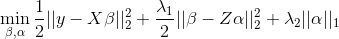
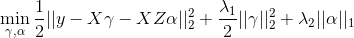
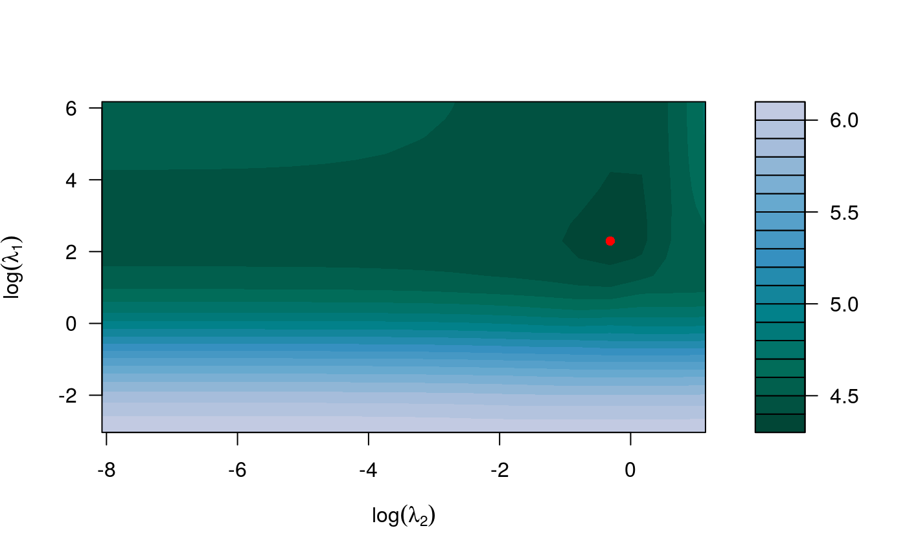
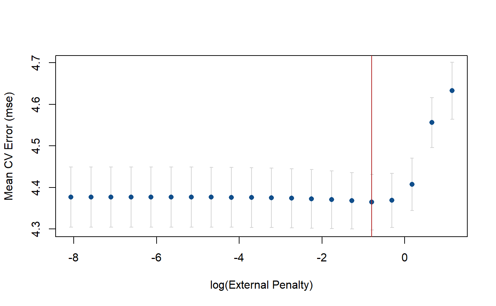

# xrnet: R Package for Hierarchical Regularized Regression to Incorporate External Data 

<!-- README.md is generated from README.Rmd. Please edit that file -->

[](https://github.com/USCbiostats/xrnet/actions/workflows/R-CMD-check.yaml)
[](https://app.codecov.io/gh/USCbiostats/xrnet?branch=master)
[](https://cran.r-project.org/package=xrnet)
[](https://doi.org/10.21105/joss.01761)

# Introduction

The **xrnet** R package is an extension of regularized regression
(i.e. ridge regression) that enables the incorporation of external data
that may be informative for the effects of predictors on an outcome of
interest. Let $y$ be an n-dimensional observed outcome vector, $X$ be a
set of *p* potential predictors observed on the *n* observations, and
$Z$ be a set of *q* external features available for the *p* predictors.
Our model builds off the standard two-level hierarchical regression
model,





but allows regularization of both the predictors and the external
features, where beta is the vector of coefficients describing the
association of each predictor with the outcome and alpha is the vector
of coefficients describing the association of each external feature with
the predictor coefficients, beta. As an example, assume that the outcome
is continuous and that we want to apply a ridge penalty to the
predictors and lasso penalty to the external features. We minimize the
following objective function (ignoring intercept terms):



Note that our model allows for the predictor coefficients, beta, to
shrink towards potentially informative values based on the matrix $Z$.
In the event the external data is not informative, we can shrink alpha
towards zero, returning back to a standard regularized regression. To
efficiently fit the model, we rewrite this convex optimization with the
variable substitution $gamma = beta - Z * alpha$. The problem is then
solved as a standard regularized regression in which we allow the
penalty value and type (ridge / lasso) to be variable-specific:



This package extends the coordinate descent algorithm of Friedman et
al. 2010 (used in the R package **glmnet**) to allow for this
variable-specific generalization and to fit the model described above.
Currently, we allow for continuous and binary outcomes, but plan to
extend to other outcomes (i.e. survival) in the next release.

# Installation

#### From CRAN

``` r
install.packages("xrnet")
```

#### From Github (most up-to-date)

1.  OS-specific prerequisites
    - *Windows*: Install
      [RTools](https://cran.r-project.org/bin/windows/Rtools/) (not an R
      package)
    - *Mac*: Verify your GNU Fortran version is \>= 6.1. If you have an
      older version, go
      [here](https://cran.r-project.org/bin/macosx/tools/) to install
      the required version.
2.  Install the R package [devtools](https://github.com/r-lib/devtools)
3.  Install the **xrnet** package with the *install_github()* function
    (optionally install potentially unstable development branch)

``` r
# Master branch
devtools::install_github("USCbiostats/xrnet")
```

# A First Example

As an example of how you might use xrnet, we have provided a small set
of simulated external data variables (ext), predictors (x), and a
continuous outcome variable (y). First, load the package and the example
data:

``` r
library(xrnet)
data(GaussianExample)
```

#### Fitting a Model

To fit a linear hierarchical regularized regression model, use the main
`xrnet` function. At a minimum, you should specify the predictor matrix
`x`, outcome variable `y`, and `family` (outcome distribution). The
`external` option allows you to incorporate external data in the
regularized regression model. If you do not include external data, a
standard regularized regression model will be fit. By default, a lasso
penalty is applied to both the predictors and the external data.

``` r
xrnet_model <- xrnet(
  x = x_linear, 
  y = y_linear, 
  external = ext_linear, 
  family = "gaussian"
)
```

#### Modifying Regularization Terms

To modify the regularization terms and penalty path associated with the
predictors or external data, you can use the `define_penalty` function.
This function allows you to configure the following regularization
attributes:

- Regularization type
  - Ridge = 0
  - Elastic Net = (0, 1)
  - Lasso / Quantile = 1 (additional parameter `quantile` used to
    specify quantile, not currently implemented)
- Penalty path
  - Number of penalty values in the full penalty path (default = 20)
  - Ratio of min(penalty) / max(penalty)
- User-defined set of penalties

As an example, we may want to apply a ridge penalty to the x variables
and a lasso penalty to the external data variables. In addition, we may
want to have 30 penalty values computed for the regularization path
associated with both x and external. We modify our model call to `xrnet`
follows.

1)  `penalty_main` is used to specify the regularization for the x
    variables
2)  `penalty_external` is used to specify the regularization for the
    external variables

``` r
xrnet_model <- xrnet(
  x = x_linear, 
  y = y_linear, 
  external = ext_linear, 
  family = "gaussian", 
  penalty_main = define_penalty(0, num_penalty = 30),
  penalty_external = define_penalty(1, num_penalty = 30)
)
```

Helper functions are also available to define the available penalty
types (`define_lasso`, `define_ridge`, and `define_enet`). The example
below exemplifies fitting a standard ridge regression model with 100
penalty values by using the `define_ridge` helper function. As mentioned
previously, a standard regularized regression is fit if no external data
is provided.

``` r
xrnet_model <- xrnet(
  x = x_linear, 
  y = y_linear, 
  family = "gaussian", 
  penalty_main = define_ridge(100)
)
```

#### Tuning Penalty Parameters by Cross-Validation

In general, we need a method to determine the penalty values that
produce the optimal out-of-sample prediction. We provide a simple
two-dimensional grid search that uses k-fold cross-validation to
determine the optimal values for the penalties. The cross-validation
function `tune_xrnet` is used as follows.

``` r
cv_xrnet <- tune_xrnet(
  x = x_linear, 
  y = y_linear, 
  external = ext_linear, 
  family = "gaussian",
  penalty_main = define_ridge(),
  penalty_external = define_lasso()
)
```

To visualize the results of the cross-validation we provide a contour
plot of the mean cross-validation error across the grid of penalties
with the `plot` function.

``` r
plot(cv_xrnet)
```

<!-- -->

Cross-validation error curves can also be generated with `plot` by
fixing the value of either the penalty on `x` or the external penalty on
`external`. By default, either penalty defaults the optimal penalty on
`x` or `external`.

``` r
plot(cv_xrnet, p = "opt")
```

<!-- -->

The `predict` function can be used to predict responses and to obtain
the coefficient estimates at the optimal penalty combination (the
default) or any other penalty combination that is within the penalty
path(s). `coef` is a another help function that can be used to return
the coefficients for a combination of penalty values as well.

``` r
predy <- predict(cv_xrnet, newdata = x_linear)
estimates <- coef(cv_xrnet)
```

#### Using the bigmemory R package with xrnet

As an example of using `bigmemory` with `xrnet`, we have a provided a
ASCII file, `x_linear.txt`, that contains the data for `x`. The
`bigmemory` function `read.big.matrix()` can be used to create a
`big.matrix` version of this file. The ASCII file is located under
`inst/extdata` in this repository and is also included when you install
the R package. To access the file in the R package, use
`system.file("extdata", "x_linear.txt", package = "xrnet")` as shown in
the example below.

``` r
x_big <- bigmemory::read.big.matrix(system.file("extdata", "x_linear.txt", package = "xrnet"), type = "double")
```

We can now fit a ridge regression model with the `big.matrix` version of
the data and verify that we get the same estimates:

``` r
xrnet_model_big <- xrnet(
  x = x_big, 
  y = y_linear, 
  family = "gaussian", 
  penalty_main = define_ridge(100)
)

all.equal(xrnet_model$beta0, xrnet_model_big$beta0)
#> [1] TRUE
```

``` r
all.equal(xrnet_model$betas, xrnet_model_big$betas)
#> [1] TRUE
```

``` r
all.equal(xrnet_model$alphas, xrnet_model_big$alphas)
#> [1] TRUE
```

## Contributing

To report a bug, ask a question, or propose a feature, create a new
issue [here](https://github.com/USCbiostats/xrnet/issues). This project
is released with the following [Contributor Code of
Conduct](https://github.com/USCbiostats/xrnet/blob/master/CODE_OF_CONDUCT.md).
If you would like to contribute, please abide by its terms.

## Funding

Supported by National Cancer Institute Grant \#1P01CA196596.
