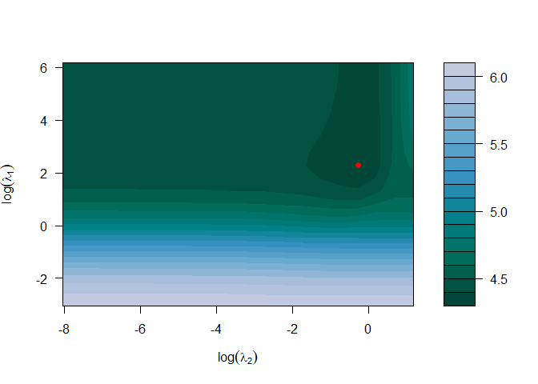

hierr: An R Package for Hierarchical Regularized Regression
================

<!-- README.md is generated from README.Rmd. Please edit that file -->
[](https://travis-ci.org/USCbiostats/hierr) [](https://codecov.io/gh/USCbiostats/hierr)

Introduction
============

The hierr R package is an extension of regularized regression (i.e. ridge regression) that enables the incorporation of external data that may be informative for the effects of the predictors on an outcome of interest. Let *y* ∈ ℝ<sup>*n*</sup> be the observed outcome vector, *X* ∈ ℝ<sup>*n* × *p*</sup> be the set of p predictors observed from n observations, and *Z* ∈ ℝ<sup>*p* × *q*</sup> be the set of q external features available for the p predictors. Assuming that the outcome is continuous, we minimize the following objective function:

min<sub>*β*, *α*</sub>||*y* − *X**β*||<sub>2</sub><sup>2</sup>

Setup
=====

1.  For Windows users, install [RTools](https://cran.r-project.org/bin/windows/Rtools/) (not an R package)
2.  Install the R package [devtools](https://github.com/hadley/devtools)
3.  Install hierr package with the install\_github function (optionally you can install the most recent / potentially unstable development branch)
4.  Load the package

``` r
library(devtools)

# Master branch
install_github("USCbiostats/hierr")

# Or the development branch
install_github("USCbiostats/hierr", ref = "development")
```

``` r
library(hierr)
```

A First Example
===============

As an example of how you might use the hierr package, we have provided a small set of simulated external data variables (ext), predictors (x), and a continuous outcome variable (y). First, load the example data:

``` r
x <- hierr::x
y <- hierr::y
ext <- hierr::ext
```

#### Fitting a Model

To fit a linear hierarchical regularized regression model, you can use the main `hierr` function. At a minimum, you should specify the predictor matrix (x), outcome variable (y), external data matrix (ext), and outcome distribution. By default, a ridge penalty is applied to the predictors and a lasso penalty is applied to the external data.

``` r
hierr_model <- hierr(x = x, y = y, external = ext, family = "gaussian")
```

#### Modifying Regularization Terms

To modify the regularization terms and penalty path associated with the predictors or external data, you can use the `definePenalty` function. This function allows you to configure the following regularization attributes:

-   Regularization type
    -   Ridge = 0
    -   Elastic Net = (0, 1)
    -   Lasso / Quantile = 1 (quantile only on development branch currently)
-   Penalty path
    -   Number of penalty values in the full penalty path (default = 20)
    -   Ratio of min(penalty) / max(penalty)
-   User-defined set of penalties

As an example, we may want to apply a ridge penalty to both the x variables and external data variables. In addition, we may want to have 30 penalty values computed for the regularization path associated with both x and external. We modify our model fitting as follows.

``` r
myPenalty <- definePenalty(penalty_type = 0, penalty_type_ext = 0, num_penalty = 30, num_penalty_ext = 30)
hierr_model <- hierr(x = x, y = y, external = ext, family = "gaussian", penalty = myPenalty)
```

#### Tuning Penalty Parameters by Cross-Validation

In general, we need a method to determine the penalty values that produce the optimal out-of-sample prediction. We provide a simple two-dimensional grid search that uses k-fold cross-validation to determine the optimal values for the penalties. The cross-validation function `cvhierr` is used as follows.

``` r
cv_hierr <- cvhierr(x = x, y = y, external = ext, family = "gaussian")
```

To visualize the results of the cross-validation we provide a contour plot of the mean cross-validation error across the grid of penalties with the `plot` function.

``` r
plot(cv_hierr)
```


